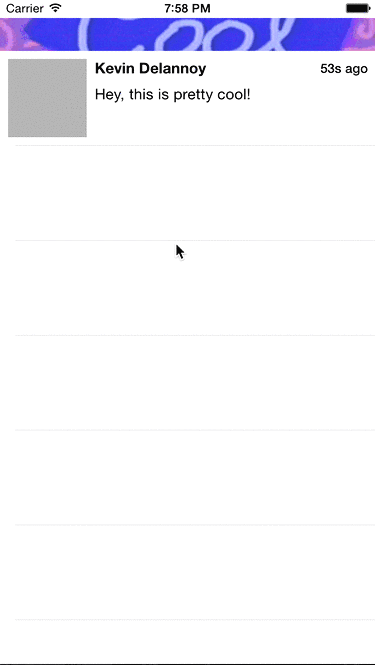
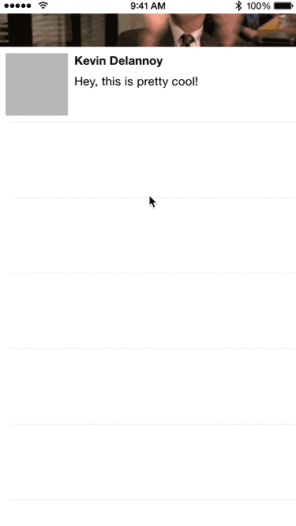
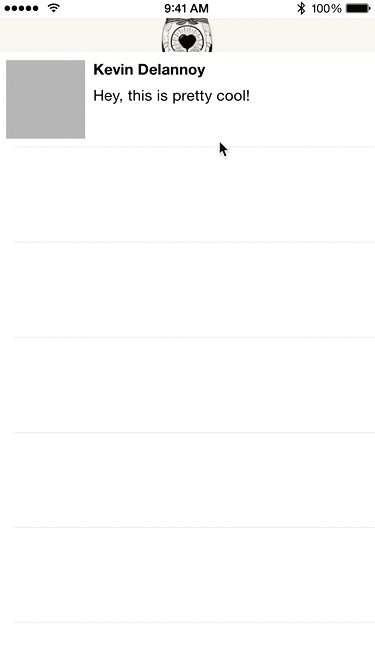

# GIFRefreshControl

GIFRefreshControl is a pull to refresh that supports GIF images as track animations.





## Installation

You have multiple choices here:
* Copy `GIFRefreshControl.swift` in your project.
* Adding it in your Podfile `pod 'GIFRefreshControl'`

## Usage
```swift
let URL = NSBundle.mainBundle().URLForResource("giphy", withExtension: "gif")
let data = NSData(contentsOfURL: URL!)

let refreshControl = GIFRefreshControl()
refreshControl.animatedImage = GIFAnimatedImage(data: data!)
refreshControl.contentMode = .ScaleAspectFill
refreshControl.addTarget(self, action: "refresh", forControlEvents: .ValueChanged)
tableView.addSubview(refreshControl)
```

### Memory consideration

Right now, the default implementation of `GIFAnimatedImage` is not optimized for memory. That's why you are able to use your custom implementation by using `AnimatedImage` (like [`FLAnimatedImage`](https://github.com/Flipboard/FLAnimatedImage)). `AnimatedImage` is a protocol that describe what is needed to use it in the refresh control.

## Contributing

1. Fork it!
2. Create your feature branch: `git checkout -b my-new-feature`
3. Commit your changes: `git commit -am 'Add some feature'`
4. Push to the branch: `git push origin my-new-feature`
5. Submit a pull request :D

## License

The MIT License (MIT)

Copyright (c) 2015 Kevin Delannoy

Permission is hereby granted, free of charge, to any person obtaining a copy
of this software and associated documentation files (the "Software"), to deal
in the Software without restriction, including without limitation the rights
to use, copy, modify, merge, publish, distribute, sublicense, and/or sell
copies of the Software, and to permit persons to whom the Software is
furnished to do so, subject to the following conditions:

The above copyright notice and this permission notice shall be included in all
copies or substantial portions of the Software.

THE SOFTWARE IS PROVIDED "AS IS", WITHOUT WARRANTY OF ANY KIND, EXPRESS OR
IMPLIED, INCLUDING BUT NOT LIMITED TO THE WARRANTIES OF MERCHANTABILITY,
FITNESS FOR A PARTICULAR PURPOSE AND NONINFRINGEMENT. IN NO EVENT SHALL THE
AUTHORS OR COPYRIGHT HOLDERS BE LIABLE FOR ANY CLAIM, DAMAGES OR OTHER
LIABILITY, WHETHER IN AN ACTION OF CONTRACT, TORT OR OTHERWISE, ARISING FROM,
OUT OF OR IN CONNECTION WITH THE SOFTWARE OR THE USE OR OTHER DEALINGS IN THE
SOFTWARE.
